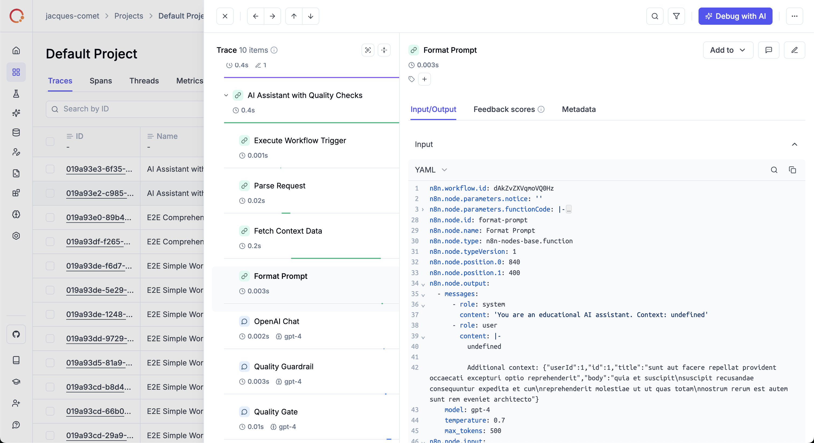

# n8n-observability

> [!IMPORTANT]
> This package only works with **self-hosted n8n** installations. It is not compatible with n8n Cloud.

OpenTelemetry instrumentation for [n8n](https://n8n.io) workflows.  
Automatically traces workflow executions and node operations using the standard OpenTelemetry SDK.



## Features
- 🔍 **Automatic tracing** of workflow executions and individual node operations
- 📊 **Standard OpenTelemetry** instrumentation using the official Node.js SDK
- 🎯 **Zero-code setup** via n8n's hook system
- 🔌 **OTLP compatible** - works with any OpenTelemetry-compatible backend
- ⚙️ **Configurable** I/O capture, node filtering, and more
- 🚀 Works with Docker, bare metal, or programmatic init
- 💻 Node.js ≥ 18

---

## Quick Start

### Prerequisites
- An OpenTelemetry-compatible backend
  - **[Opik](https://www.comet.com/opik)** (recommended - examples below use Opik)
  - Or any other OTEL provider: Jaeger, Grafana Tempo, Honeycomb, Datadog, etc.
- Or use console exporters for development

---

## Setup Options

### A) Docker — **custom image installs the npm package**
```dockerfile
# Dockerfile
FROM n8nio/n8n:latest
USER root
WORKDIR /usr/local/lib/node_modules/n8n
RUN npm install n8n-observability
ENV EXTERNAL_HOOK_FILES=/usr/local/lib/node_modules/n8n/node_modules/n8n-observability/dist/hooks.cjs
USER node
```

```bash
docker build -t my-n8n-otel .

# For Opik Cloud
docker run -p 5678:5678 \
  -e OTEL_EXPORTER_OTLP_ENDPOINT=https://www.comet.com/opik/api/v1/private/otel \
  -e OTEL_EXPORTER_OTLP_HEADERS='Authorization=<your-api-key>,Comet-Workspace=default' \
  -e N8N_OTEL_SERVICE_NAME=my-n8n \
  my-n8n-otel

# Or for local Opik
docker run -p 5678:5678 \
  -e OTEL_EXPORTER_OTLP_ENDPOINT=http://localhost:5173/api/v1/private/otel \
  -e N8N_OTEL_SERVICE_NAME=my-n8n \
  my-n8n-otel
```

---

### B) Docker — **no custom image**, mount the hook file from host
```yaml
# docker-compose.yml
services:
  n8n:
    image: n8nio/n8n:latest
    environment:
      # For Opik Cloud
      - OTEL_EXPORTER_OTLP_ENDPOINT=https://www.comet.com/opik/api/v1/private/otel
      - OTEL_EXPORTER_OTLP_HEADERS=Authorization=<your-api-key>,Comet-Workspace=default
      # Or for local Opik: http://localhost:5173/api/v1/private/otel
      - N8N_OTEL_SERVICE_NAME=my-n8n
      - EXTERNAL_HOOK_FILES=/data/otel-hooks.cjs
    volumes:
      - ./node_modules/n8n-observability/dist/hooks.cjs:/data/otel-hooks.cjs:ro
      - n8n_data:/home/node/.n8n
    ports:
      - "5678:5678"
      
volumes:
  n8n_data:
```

> **Note:** Ensure `n8n-observability` is installed on the host (e.g., `pnpm i` in your repo) so the mounted `dist/hooks.cjs` exists.  
> This configuration uses Opik as the backend. Works with **any OTEL-compatible provider** - just update the endpoint and headers accordingly.

---

### C) Bare metal / npm terminal
```bash
# install globally OR locally
npm install -g n8n-observability

# For Opik Cloud
export OTEL_EXPORTER_OTLP_ENDPOINT=https://www.comet.com/opik/api/v1/private/otel
export OTEL_EXPORTER_OTLP_HEADERS='Authorization=<your-api-key>,Comet-Workspace=default'

# Or for local Opik
# export OTEL_EXPORTER_OTLP_ENDPOINT=http://localhost:5173/api/v1/private/otel

export N8N_OTEL_SERVICE_NAME=my-n8n
export EXTERNAL_HOOK_FILES=$(node -e "console.log(require.resolve('n8n-observability/hooks'))")

n8n start
```

---

### D) Programmatic (custom runner)
```ts
// init.mjs or your bootstrap
import { setupN8nObservability } from 'n8n-observability';

await setupN8nObservability({
  serviceName: process.env.N8N_OTEL_SERVICE_NAME ?? 'n8n',
  debug: process.env.N8N_OTEL_DEBUG === '1',
});

// then start n8n (your normal start chain)
```

---

## Configuration

| Variable                    | Purpose                                | Default |
| --------------------------- | -------------------------------------- | ------- |
| `OTEL_SERVICE_NAME`         | Service name for telemetry             | `n8n`   |
| `N8N_OTEL_SERVICE_NAME`     | Alternative service name (takes precedence) | —   |
| `OTEL_EXPORTER_OTLP_ENDPOINT` | OTLP exporter endpoint              | —     |
| `OTEL_EXPORTER_OTLP_HEADERS` | OTLP headers (e.g., auth tokens)      | —     |
| `N8N_OTEL_NODE_INCLUDE`     | Only trace listed nodes (name/type)    | —       |
| `N8N_OTEL_NODE_EXCLUDE`     | Exclude listed nodes (name/type)       | —       |
| `N8N_OTEL_CAPTURE_INPUT`    | Capture node I/O (`false` disables)    | `true`  |
| `N8N_OTEL_CAPTURE_OUTPUT`   | Capture node output (`false` disables) | `true`  |
| `N8N_OTEL_AUTO_INSTRUMENT`  | Enable HTTP/Express/etc instrumentation | `false` |
| `N8N_OTEL_METRICS`          | Enable metrics (CPU, memory, etc.)     | `false` |
| `N8N_OTEL_DEBUG`            | Hook patching diagnostics              | `false` |
| `EXTERNAL_HOOK_FILES`       | Path to `dist/hooks.cjs` (hook modes)  | —       |

> **Works with all OTEL providers:** The examples above use Opik, but you can use any OpenTelemetry-compatible backend (Jaeger, Grafana Tempo, Honeycomb, Datadog, New Relic, etc.) by updating the `OTEL_EXPORTER_OTLP_ENDPOINT` and authentication headers accordingly.

### Output Control

**By default**, n8n-observability only traces **workflow and node spans** from n8n itself. This gives you clean, high-level traces focused on your workflows.

To enable additional instrumentation:
```bash
# Enable HTTP, Express, and other Node.js library instrumentation
export N8N_OTEL_AUTO_INSTRUMENT=true

# Enable metrics (CPU, memory, HTTP request durations, etc.)
export N8N_OTEL_METRICS=true
```

### Node Filtering

```bash
# Only trace specific nodes
export N8N_OTEL_NODE_INCLUDE="OpenAI,HTTP Request"

# Exclude specific nodes
export N8N_OTEL_NODE_EXCLUDE="Wait,Set"

# Disable input/output capture for privacy
export N8N_OTEL_CAPTURE_INPUT=false
```

---

## Configuring Exporters

By default, this package uses **console exporters** for development. To send telemetry to a real backend, use environment variables:

### Opik (Recommended)

```bash
# Opik Cloud
export OTEL_EXPORTER_OTLP_ENDPOINT=https://www.comet.com/opik/api/v1/private/otel
export OTEL_EXPORTER_OTLP_HEADERS='Authorization=<your-api-key>,Comet-Workspace=default'

# Or local Opik
export OTEL_EXPORTER_OTLP_ENDPOINT=http://localhost:5173/api/v1/private/otel
```

### Other OTEL Providers

Works with any OpenTelemetry-compatible backend. Just configure the endpoint:

```bash
# Generic OTLP endpoint
export OTEL_EXPORTER_OTLP_ENDPOINT=http://your-collector:4318

# With authentication (if required)
export OTEL_EXPORTER_OTLP_HEADERS='Authorization=Bearer <token>'
```

**Examples for specific providers:**
- **Jaeger**: `http://jaeger:4318`
- **Grafana Tempo**: `http://tempo:4318`
- **Honeycomb**: `https://api.honeycomb.io` with header `x-honeycomb-team=<api-key>`
- **Datadog**: Configure via Datadog agent endpoint

---

## Verify

Check package is installed:
```bash
node -e "console.log(require.resolve('n8n-observability/hooks'))"
```

Expected startup log:
```text
[n8n-observability] observability ready and patches applied
[otel-setup] OpenTelemetry SDK initialized for service: n8n
```

---

## Span Attributes

### Workflow Spans
- `n8n.workflow.id`: Workflow ID
- `n8n.workflow.name`: Workflow name
- `n8n.span.type`: `"workflow"`

### Node Spans
- `n8n.node.type`: Node type (e.g., `n8n-nodes-base.httpRequest`)
- `n8n.node.name`: Node name
- `n8n.span.type`: `"llm"`, `"prompt"`, `"evaluation"`, or undefined
- `n8n.node.input`: JSON input data (if capture enabled)
- `n8n.node.output`: JSON output data (if capture enabled)
- `gen_ai.system`: AI system name (e.g., `openai`, `anthropic`)
- `gen_ai.request.model`: Model name (e.g., `gpt-4`)

---

## Examples

### Complete Docker Setup
See [`examples/docker-compose/`](./examples/docker-compose/) for a complete working example with Comet ML (Opik).

### Using Different Backends

The package works with **any OTEL-compatible backend**. Here are examples:

**Opik (Cloud):**
```bash
export OTEL_EXPORTER_OTLP_ENDPOINT=https://www.comet.com/opik/api/v1/private/otel
export OTEL_EXPORTER_OTLP_HEADERS='Authorization=<your-api-key>,Comet-Workspace=default'
```

**Opik (Local):**
```bash
export OTEL_EXPORTER_OTLP_ENDPOINT=http://localhost:5173/api/v1/private/otel
```

**Grafana Tempo:**
```yaml
services:
  n8n:
    environment:
      - OTEL_EXPORTER_OTLP_ENDPOINT=http://tempo:4318
      
  tempo:
    image: grafana/tempo:latest
    ports:
      - "3200:3200"
      - "4318:4318"
```

**Jaeger:**
```yaml
services:
  n8n:
    environment:
      - OTEL_EXPORTER_OTLP_ENDPOINT=http://jaeger:4318
      
  jaeger:
    image: jaegertracing/all-in-one:latest
    ports:
      - "16686:16686"
      - "4318:4318"
```

---

## More Info

See technical details and troubleshooting in:
[`packages/n8n-observability/README.md`](./packages/n8n-observability/README.md)

---

## Development

### Build
```bash
pnpm install
pnpm --filter n8n-observability build
```

### Test with n8n
```bash
cd examples/docker-compose
docker-compose up
```


## License

MIT - See [LICENSE](./LICENSE) for details.

---

## Acknowledgments

> [!NOTE]
> This project is a fork of [LangWatch's n8n-observability](https://github.com/langwatch/n8n-observability). We're grateful for their excellent work in creating the original implementation and bringing observability to n8n workflows. Their contributions have been instrumental in making this project possible. We've extended their code to work with **all OpenTelemetry providers** (not just LangWatch), making it a universal solution for n8n observability with any OTEL-compatible backend.
